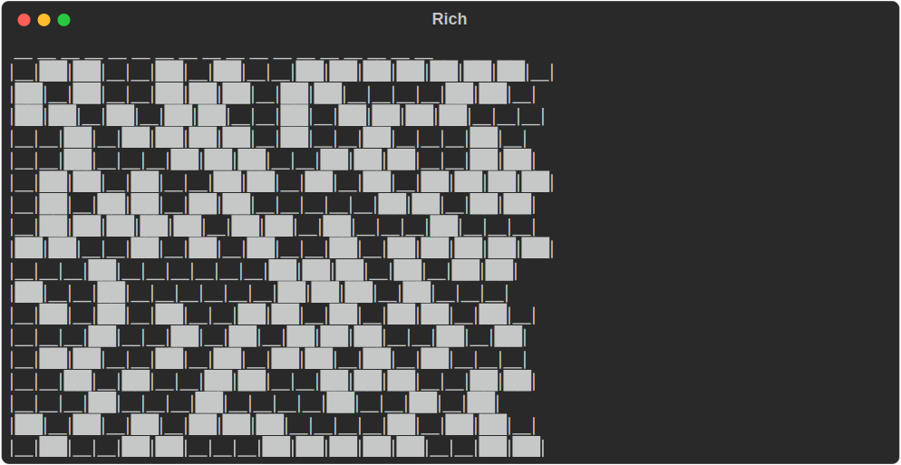
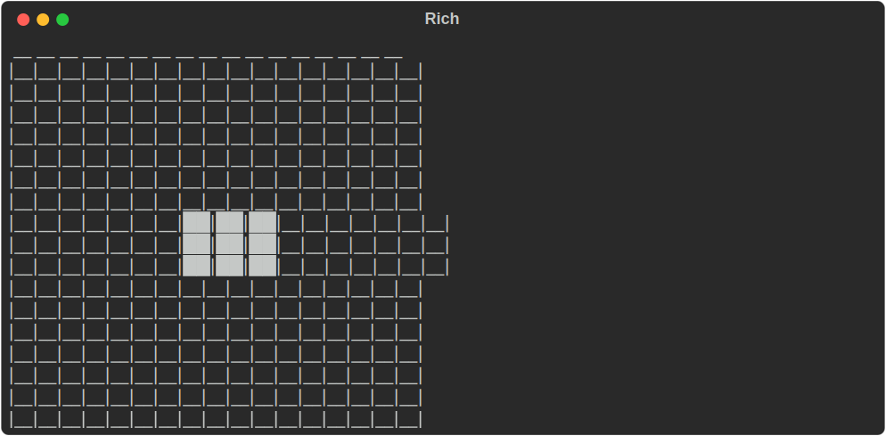
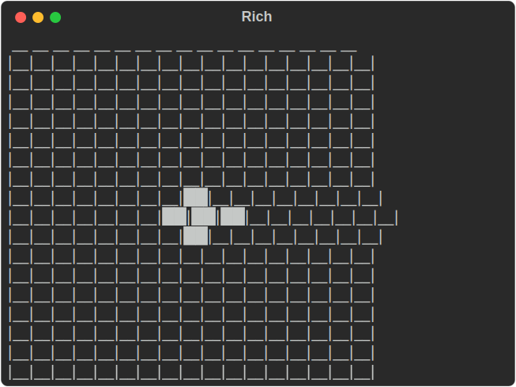
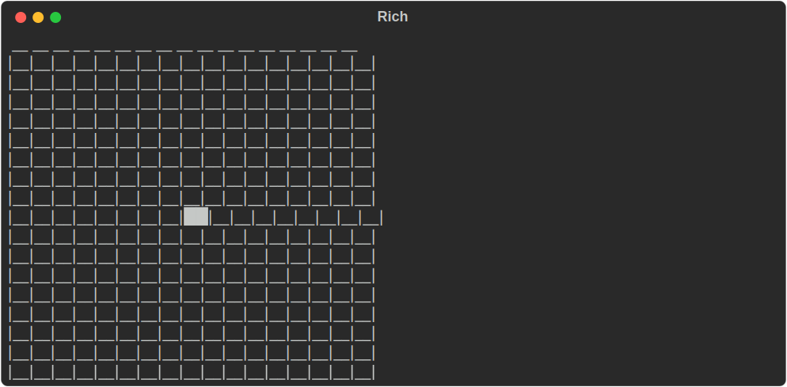
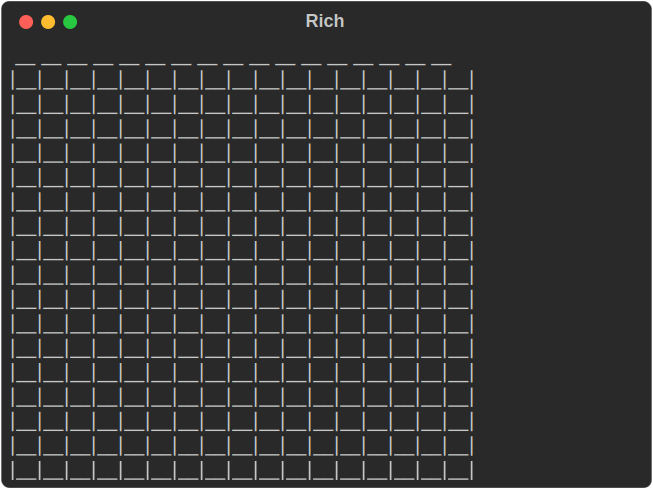
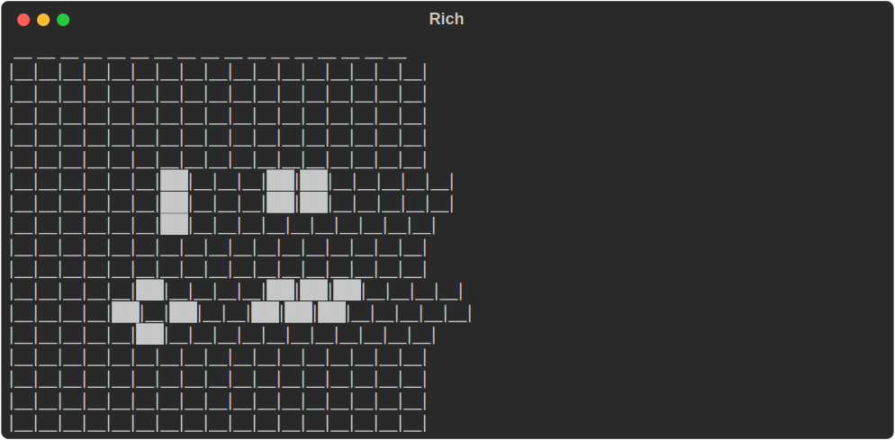
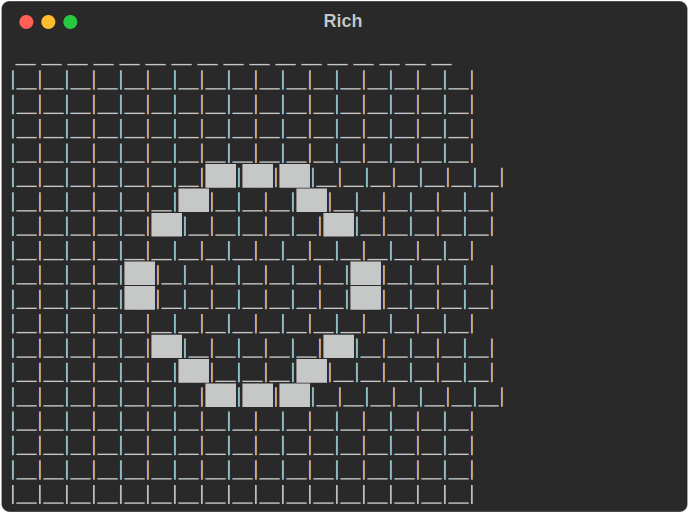
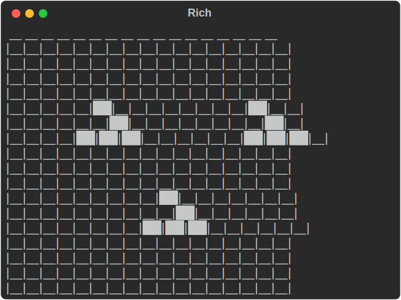
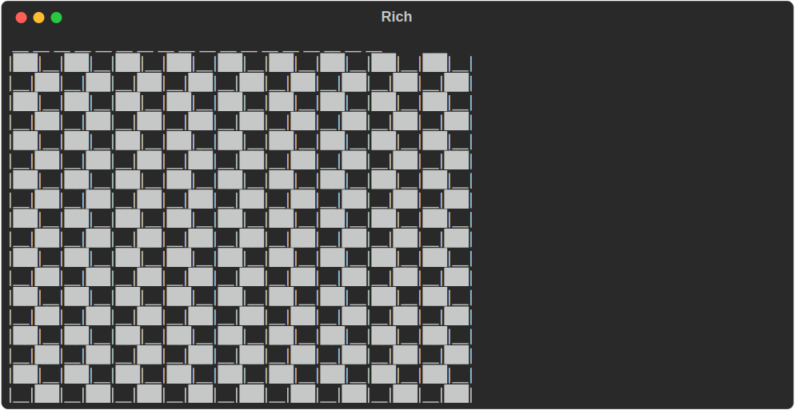

# discrete-ca-sim
Python app for visualizing a parameterized version of [Conway's Game of Life](https://en.wikipedia.org/wiki/Conway%27s_Game_of_Life). Written for the CAS502: Computation course at ASU.


## Project Description
This project aims to create a small app for exploring discrete cellular automata dynamics through visualization of a user-controlled update rule. The app will be designed to mimic Conway’s Game of Life while parameterizing aspects of the update rule to allow for exploration of their impacts on the dynamics. 

Cellular Automata are a computational phenomenon used to study a variety of concepts in Complex Adaptive Systems Science including emergence, decentralized coordination, and computation. The most famous Cellular Automata, which this app is based on, is Conway’s Game of Life. It works by first instantiating a grid of binary values, 1s corresponding conceptually with “living cells” and 0s corresponding with “dead cells.” A rule is defined for how cells update their state over time based solely on their current state and the count of living neighbors (the eight neighbors in their 3x3 neighborhood). The rule is then applied iteratively to the grid of values, sometimes resulting in interesting patterns and emergent capabilities as cells interact with their neighbors and turn on and off. 

The update rule for Conway’s Game of Life can be decomposed into two sets:
1. For living cells: which counts (0-8) of living neighbors result in the cell staying alive. This is referred to in the code as the survival_set.
2. For dead cells: which counts (0-8) of living neighbors result in the cell becoming alive. This is referred to in the code as the birth_set.

For Conway's Game of Life the rule is: survival_set={2, 3}, birth_set={3}.
These sets are denoted with the convention S<digits>B<digits>. For example "S23B3".

These two sets are alterable by the user in the CLI, allowing them to probe the system to try to get a sense of the influence these parameters have over the dynamics of the system. 
As the starting state also has a profound effect on the ensuing behavior, the user also has a series of starting states to choose from when running the simulation.
As the CA rolls out over several steps, the state of the grid after each update step is displayed in the terminal to give a window into the system’s dynamics.


## Author
Rockwell Gulassa


# User Guide


## Installation
Follow these steps to set the app up on your local machine:


### 1. Clone the repository
Open your terminal and navigate to the directory where you want to install the app. Then run the following to download it:

```
git clone https://github.com/Rupellary/discrete-ca-sim.git
cd discrete-ca-sim
```

### 2. Create virtual environment
[Conda](https://www.anaconda.com/docs/getting-started/miniconda/install) is recommended for the environment. venv most likely works as well but it has not been tested. Importantly, the program was written in python 3.13, other versions of python have not been tested. To create and activate the environmnet with conda run the following:

```
conda create -n discrete-ca-sim python=3.13
conda activate discrete-ca-sim
```

### 3. Install dependencies
Use the requirements file to install all the dependencies for the project by running the following:
```
pip install -r requirements.txt
```
Now you should be set up to start running the application.


## Usage
From the root directory you can run the app from the command line with the following:
```
python main.py
```
This will run it with the default parameter settings which uses the Game of Life's update rule and randomly selects one of the starting states. However, providing additional arguments in the command allows for much more user control.

| Argument                 | Type  | Default         | Description |
|--------------------------|-------|-----------------|-------------|
| `-s`, `--steps`          | int   | 30              | Number of steps to rollout for the animation. |
| `-r`, `--rule`           | str   | "S23B3"         | CA update rule. [See below](#rule-specification-syntax) for more details on the notation. |
| `--start`                | str   | "random_choice" | Choice of starting state for the simulation. [See below](#starting-state-options) for more details on the options. |
| `-ur`, `--update_rate`   | float | 1.0             | For asynchronous CA. Values less than 1 result in stochastic updating where cells have this probability of updating at each step. |
| `-sd`, `--seed`          | int   | `None`          | Random seed for determinsitic randomization. Only affects asynchronous updating.Randomly generated starting states are fixed through later user input ([See below](#randomly-generated-starting-states) for more details). |
| `-sps`, `--sec-per-step` | float | 0.3             | Seconds between steps while animating. Smaller values speed up the animation. |


### Rule Specification Syntax

As mentioned in the project description, this application keeps the core logic of Conway's Game of Life, namely that cells can either be on or off, "alive" or "dead", and at each step they change their state based solely on:

1. The count of "alive" cells out of the 8 in their 3x3 neighborhood.
2. Their own current state as "alive" or "dead."

But the application generalizes the specific state transition conditions. These transitions can be summarized with 2 sets:

1. The set of alive-neighbor counts that transition "alive" cells to the "alive" state. This is referred to as the "survive set."
2. The set of alive-neighbor counts that transition "dead" cells to the "alive" state. This is referred to as the "birth set."

With these two sets specified, all possible state transitions can be infered.

To set an update rule for the cellular automaton, you can pass in a string that specifies these two sets following the pattern "S<survive-set-digits>B<birth-set-digits>". For example, Conway's Game of Life follows the rule that living cells only survive when they have exactly 2 or 3 living neighbors and dead cells only become alive if they have exactly 2 living neighbors. This can be expressed with this pattern as "S23B3". 

#### Input Validation
* No other characters are allowed, the string must match the regex pattern `"^S\d*B\d*$"`
* Cells only have 8 neighbors so including 9 in your list of digits will raise a warning.
* Double-digit numbers are interpreted as two individual digits. A cell cannot have > 8 neighbors so there is no sense to double-digit numbers anyways.
* Any redundant digits are silently ignored; e.g. "S233B33" == "S23B3"
* Empty sets are allowed; e.g. "SB04"


### Starting State Options

There are a variety of options that can be selected for the starting state of the CA rollout, each of which provide a different window into the rule's dynamics. 

#### `--start random_choice`
This is the default option, it randomly selects from the other options. 

#### `--start randomize`
Randomly generates the starting state after prompting user for additional specifications. [See below](#randomly-generated-starting-states) for more details.

<p align="center">
  
</p>

#### `--start block`

<p align="center">
  
</p>

#### `--start diamond`

<p align="center">
  
</p>

#### `--start seed`

<p align="center">
  
</p>

#### `--start nothing`
This will only result in behavior if the birth set includes 0.

<p align="center">
  
</p>

#### `--start classic_shapes`
These shapes have [interesting behavior](https://en.wikipedia.org/wiki/Conway%27s_Game_of_Life#:~:text=edit%20source%5D-,Pattern%20taxonomy,-%5Bedit%20source) under the original Game of Life rule.

<p align="center">
  
</p>

#### `--start oscillator`
This shape results in a repeating cycle of states under the original Game of Life rule. 

<p align="center">
  
</p>

#### `--start gliders`
The ["Glider"](https://en.wikipedia.org/wiki/Glider_(Conway%27s_Game_of_Life)) is a well-known shape in the Game of Life. It is the simplest pattern that repeats itself translated as though moving through the space.

<p align="center">
  
</p>

#### `--start checkered`

<p align="center">
  
</p>


### Randomly Generated Starting States

If you select "randomize" for the starting state, a starting state will be randomly generated on the fly. Before generating, however, the app will ask for some additional specifications to be provided through prompts in the command line:

1. The width of the grid.
2. The height of the grid.
3. The probability each cell has of being "alive". Using lower values will make the starting state more sparse, while using higher values will result in starting states where most of the cells are already "alive".
4. A random seed to make the generation deterministic for reproducibility. Make sure you remember what you input if you want to try running it with the same starting state again.

Rather than throwing errors, if the user accidentally inputs something invalid when answering these prompts, the app notifies the user and asks for a new input.


## Reporting Bugs and Requesting Features


### Reporting Bugs

To report a bug, follow these steps:
1. Double check you have properly followed the installation and usage instructions
2. Try to reproduce the bug in as few steps as possible
3. Open an issue on GitHub
4. In the issue write...
  i. How to reproduce the bug
  ii. What you expected to happen
  iii. What actually happened
  iv. Any helpful screenshots
  v. Details on what versions of the used packages you have installed (they should match what is in the installation instructions) and the OS you are running
  vi. What version of this app you are running
5. Select the label "user-reported-bug" in the issue labels


### Requesting Features

To request a feature, follow these steps:
1. Open an issue on GitHub 
2. Describe the functionality you would like the app to have
3. Select the label "user-requested-feature" in the issue labels


## Contributing

Contributions are welcome! 

To maintain readability, I request that you follow the style conventions of the current codebase. You may pick these up by reading, but some are listed explicitly below. A pull request will not be rejected based purely on stylistic grounds, but stylistic coherence is a factor as it enhances readability so it is highly encouraged that you stick to these patterns as much as possible.


### Git Workflow

Follow these steps:
1. Fork the repository
2. Create a branch following the established [branch naming conventions](https://medium.com/@mandolkarmakarand94/git-branch-naming-and-commit-best-practices-cheatsheet-875316b9ca20#:~:text=1.%20Branch%20Naming%20Conventions), e.g. `git checkout -b feat/feature-name`.
3. Make commits following the established [commit naming conventions](https://medium.com/@mandolkarmakarand94/git-branch-naming-and-commit-best-practices-cheatsheet-875316b9ca20#:~:text=2.%20Writing%20Meaningful%20Commits) as much as possible, e.g. `git commit -m "fix: ..."`
4. Open an issue on GitHub describing what your feature adds. Make sure you add the label "user-created-feature" to the issue.
5. Create a pull request with your fork and link it to the issue you just created.


### Comments

Comments follow gramatical patterns:
1. When using headers to group chunks of code together comments follow this pattern: `# --- <title case noun phrase> ---`. For example: `# --- Generating Random Starting States ---`
2. When using comments on a line by line basis, they switch to the imperative mood. For example: `# Generate random starting state`
3. Comments that appear in the same line as code are minimized, but when used follow this pattern: `<code>  # <lower case comment>`. For example  `0: "_" * _CELL_WIDTH,  # how dead cells will be displayed`. Note that there are two spaces after the code before the hash.
4. Comments do not end with periods
5. Occassionally, if helpful, subheadings can be used with one less hyphen. For example: `# -- <title case noun phrase> --`

Comments should focus on explaining the step of logic being implemented in the code, and if needed clarify the role that step plays in the larger goal this code fits into, rather than simply describing how the code will execute.


### Docstrings

Docstrings follow the numpy format and should be included with all functions. 


### Type Hinting

For a variety of reasons, type hinting is being used excessively. Any time a variable is being assigned and a type hint is possible it should be included. 

However, if type hinting would require some bit of refactoring it is only requested if the type is truly vague (for instance, the output from a function assigned to a variable whose name does not fully disambiguate the type). As long as it is clear through comments or otherwise, you can, for instance, assign multiple variables at once even though it prohibits type hinting, and do not need extra lines initializing variables purely for the sake of type hints. 

Type hints should always be used for function parameters, function outputs, and variables that start off empty (empty list, dict, etc.).

Rule of thumb: use type hints as much as possible, unless it truly comes at a cost that is greater than the reward.


### Other Style Choices

* Always use double quotes (`"<string>"`) for strings instead of single quotes (`'<string>'`).
* Separate imports from other files from imports from libraries etc. with one line break.
* ...

In general, if you want to help maximize style consistency, you can look for existing code that does something similar to what you are trying to do and check for style patterns in the existing codebase.